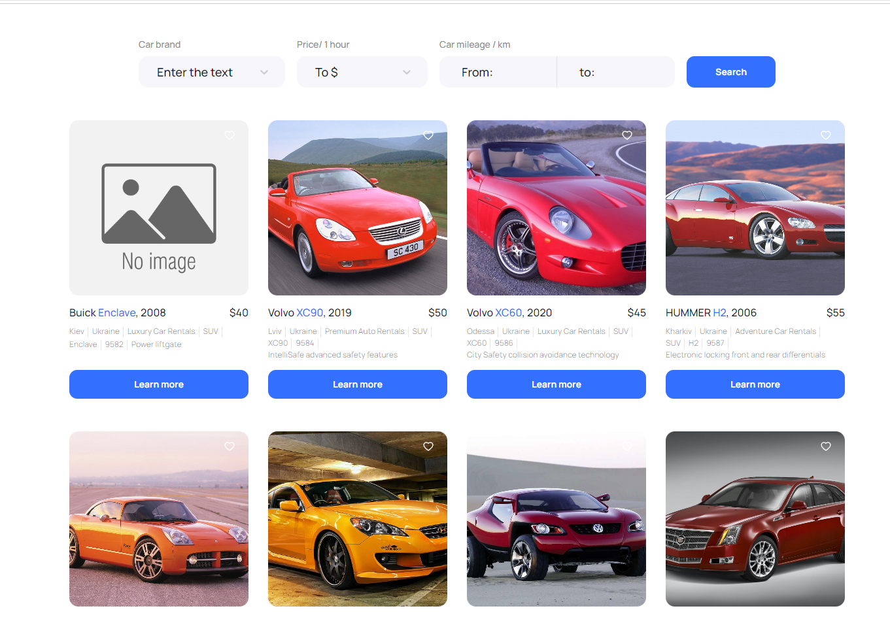
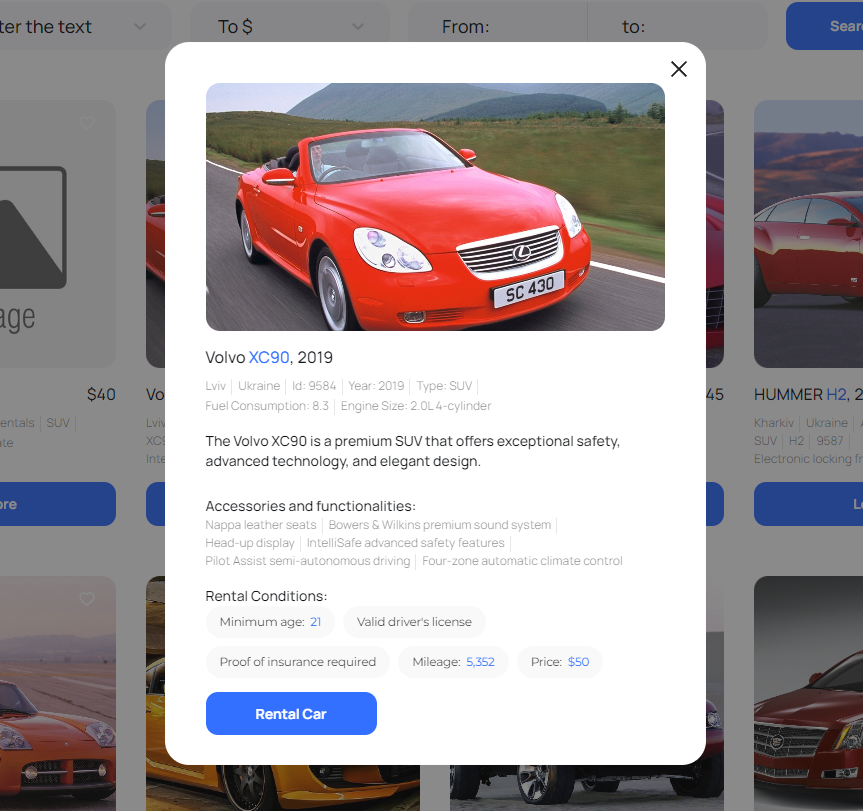
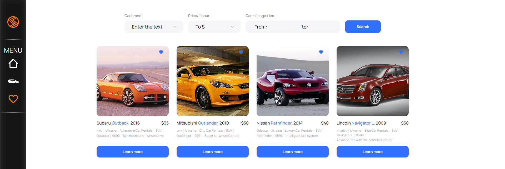
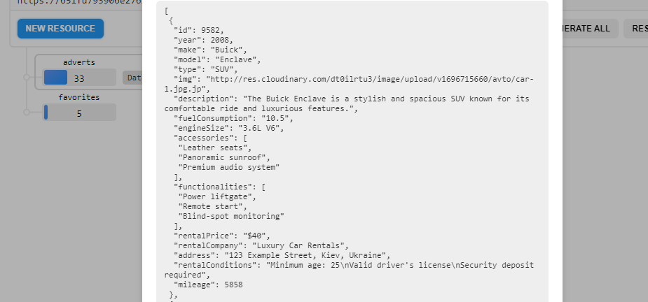

# Car sharing Service App

This is a website for Car sharing services. It consists of:

The appearance of the program consists of a sidebar and a viewing area.

- Home page
- Catalog page - the page contains a catalog of cars of various configurations,
  which the user can filter by brand, price per hour of car rental and the
  number of kilometers covered by the car during its operation (mileage).
- Favorites page - page with ads that have been added to favorites by the user
- 404 page - redirects the user to the home page.

## Functionality

On the Catalog page, the user sees a list of ads and filters. 8 ads are rendered
on the first page of the catalog, after clicking on the Load more button, the
next 8 ads are added. If you click on the button in the form of a "heart" on the
ad card, it is added to the list of favorites, and the color of the button
changes. If you click on the Learn more button, a modal window opens with
detailed information about the car and its rental conditions. The Rental car
button is a link that allows the user to contact the company by phone number
+380730000000.

Filters: dropdown with car brands show ads with cars of the corresponding brand
dropdown with prices per hour of car rental (step 10$) - show ads with cars
whose rental price belongs to the price range selected by the user a group of
selects to determine the mileage range within which the user will search for an
ad.

Favorites page: The same functionality as on the catalog page, but only with ads
added to favorites.

# For Developers

This project is developed with
[Create React App](https://github.com/facebook/create-react-app).

## Copy of project

1. Make a copy of this project.
2. Don't forget in properties allow git-hub-actions.
3. Clone the project to your computer
4. Install all dependencies with: `npm i`
5. Change project name and username in package.json in fields "name" and
   "homepage"
6. in index.js write the correct basename="/your-repo-name" of your project
7. Pull your changes to GitHub
8. For deploying, you can use gh-pages.
9. To start your project, use the command: `npm start`

## Backend

For backend, we use UI-service https://mockapi.io/.

